# Networking-Lab: VLAN-DHCP-ACL-Configuration
**Welcome to the Networking Lab Project to demonstrate VLAN, DHCP,and ACL Configuration**
## Project Overview
A comprehensive Packet Tracer project demonstrating core networking concepts, including:  
- VLANs (Virtual Land Area Networks)  
- Inter-VLAN Routing  
- DHCP (Dynamic Host Configuration Protocol)   
- ACLs (Access Control Lists)

This project demonstrates the configuration of a simulated network with VLANs, routing, DHCP, and ACLs. The objective of this project is to design and implement a network that meets the needs of a small organization with multiple departments. In this documentation, I will walk you through the step-by-step process of configuring the network, including VLANs, routing, DHCP,and ACLs.

## Brief Description of the used concepts and the Roles they play in the network
1. **VLANs (Virtual land Area Networks)**
- **Purpose:** Segment a network into smaller, isolated segments (VLANs) to improve organization, security, and management.
- **Role:** VLANs act as separate networks, allowing devices within a VLAN to communicate with each other but not with devices in other VLANs without routing.

2. **Routing Configuration**
- **Purpose:** Enable communication between VLANs and other networks.
- **Role:** Routers connect multiple VLANs and networks, allowing devices to communicate with each other across different VLANs.

3. **DHCP (Dynamic Host Configuration Protocol) Configuration**
- **Purpose:** Automatically assign IP addresses to devices on a network.
- **Role:** DHCP servers assign IP addresses, subnet masks, default gateways, and other network settings to devices, eliminating the need for manual configuration.

4. **ACL (Access Control List) Configuration**
- **Purpose:** Control traffic flow between networks and devices.
- **Role:** ACLs filter traffic based on source and destination IP addresses, ports, and protocols, allowing or blocking traffic as needed.

## Tools used for this Lab
- Cisco Packet Tracer  
- Virtual Studio Code Terminal (for documentation editing)  
- Git & GitHub (for version control)

## Network Topology
| Device | Quantity | Purpose |
|---------|--------|------------------|
|Router (Cisco 2911)| 1 | Inter-VLAN Routing, DHCP & ACLs Configurations |
|Multilayer Switch (3650-24PS) | 1 | Central distribution/trunk switch
|Switches (Cisco Catalyst 2960)| 3 | Connect end devices, assign VLANs, forward traffic to trunk uplinks
|Laptops | 8 | End devices |

## IP Address Scheme
| VLAN |	Subnet |	Gateway |	DHCP Range |
|-----------------|----------------|--------------|---------------------|
|VLAN 10(Operations-Department)|192.168.10.0/24|192.168.10.1|	192.168.10.11 - 192.168.10.50|
|VLAN 20 (Finance-Department)|	192.168.20.0/24|192.168.20.1|	192.168.20.11 - 192.168.20.50|
|VLAN 30 (HR-Department)|	192.168.30.0/24|	192.168.30.1|	192.168.30.11 - 192.168.30.50|

# Step-by-Step Configuration of the Simulated Network in Cisco Packet Tracer
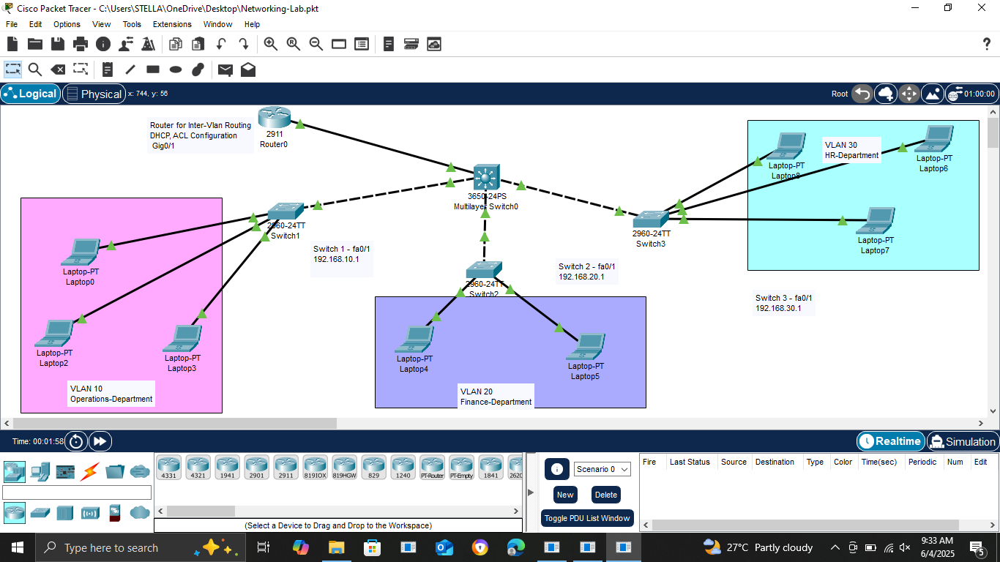
## STEP 1: Network Design
### Open Cisco Packet Tracer and Set Up the Topology
- Launch Cisco Packet Tracer.
On the open blank space: 
- Click "End Devices" > click and drop 8 Laptops into the setup 
- Click "Switches" under Networking devices > click and drop:
    - 1 Multilayer Switch (3650-24PS)
    - 3 Access Switches (2960-24TT)
- Click "Routers" under Networking devices> click and drop Router (2911)

## STEP 2: Physically connect the devices 
Use the “Connections” lightning icon on the left:
Choose "first cable" to automatically choose connection type for the devices (Access Switches and laptops connection) 

**Connect:**
Each PC to a port on an Access Switch 
   - 3 Laptops to Switch 1
   - 2 Laptops to Switch 2 
   - 3 Laptops to Switch 3

**Connect:** 
Each Access Switch to the Multilayer Switch using a Copper Cross-Over cable 
   - Switch 1 - Fa0/1  to Multilayer Switch - Gig1/0/1
   - Switch 2 - Fa0/1  to Multilayer Switch - Gig1/0/2
   - Switch 3 - Fa0/1  to Multilayer Switch - Gig1/0/3

**Connect:** 
Multilayer Switch to the Router using a copper straight-through cable 
   - Router - (Gig0/1) to Multilayer Switch  - (Gig1/0/4)

## STEP 3: Turn on the Multilayer Switch 
 - Click on the Multilayer Switch 
 - On the physical session, click on AC-POWER-SUPPLY and drag to an empty space in the Switch Physical Device View

## STEP 4: Create VLANs and assign ports on the Access Switches (2960-24TT)
### i. Create VLAN 10 on Switch 1
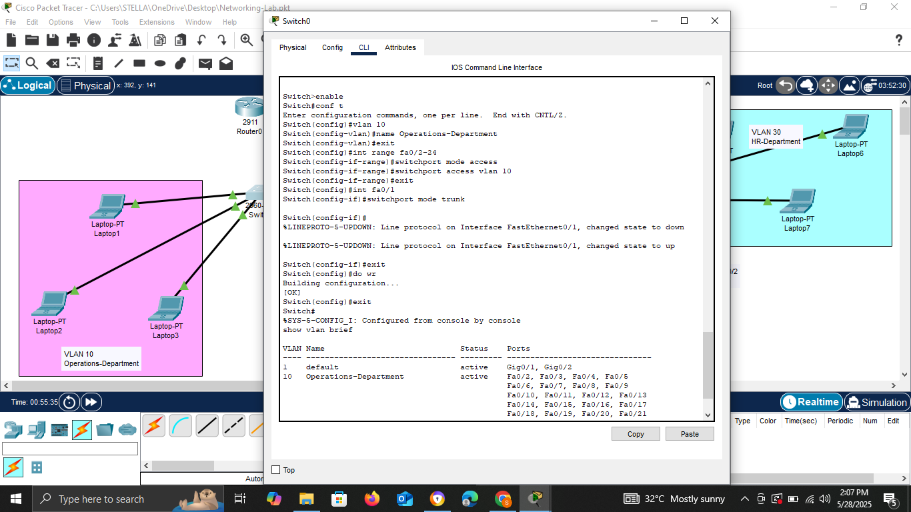
- click on the Switch 1 device
- enter into the CLI

```bash
Switch# configure terminal
Switch(config)# vlan 10
Switch(config-vlan)# name Operations-Department
Switch(config-vlan)# exit
```

### Assign Ports to VLAN 10 (Fa0/2–Fa0/24)

```bash
Switch# configure terminal
Switch(config)# int range fa0/2-24
Switch(config-if-range)# switchport mode access
Switch(config-if-range)# switchport access vlan 10
Switch(config-if-range)# exit
```

### Make Fa0/1 a Trunk Port on Switch 1

```bash
Switch(config)# int fa0/1
Switch(config-if)# switchport mode trunk
Switch(config-if)# exit
Switch(config)# do wr
Switch(config)# exit
```

### ii. Create VLAN 20 on Switch 2
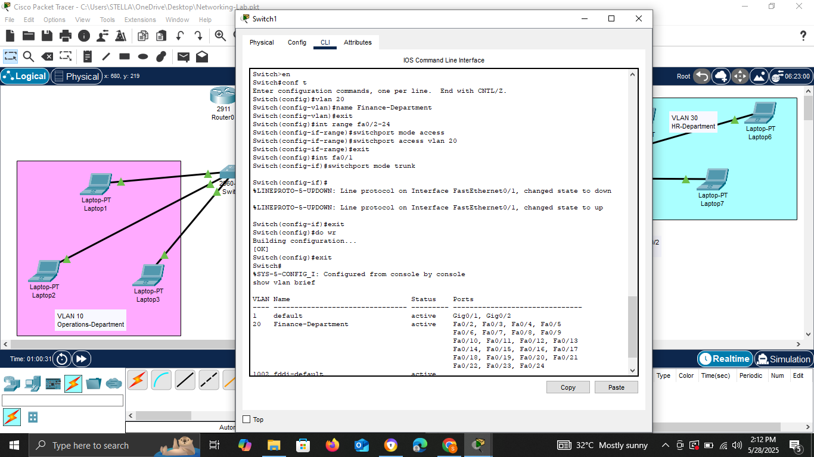
- click on the Switch 2 device
- enter into the CLI

```bash
Switch> enable
Switch# configure terminal
Switch(config)# vlan 20
Switch(config-vlan)# name Finance-Department
Switch(config-vlan)# exit
```

### Assign Ports to VLAN 20 (Fa0/2–Fa0/24)

```bash
Switch# configure terminal
Switch(config)# int range fa0/2-24
Switch(config-if-range)# switchport mode access
Switch(config-if-range)# switchport access vlan 20
Switch(config-if-range)# exit
```

### Make Fa0/1 a Trunk Port on Switch 2

```bash
Switch(config)# int fa0/1
Switch(config-if)# switchport mode trunk
Switch(config-if)# exit
Switch(config)# do wr
Switch(config)# exit
```

### iii. Create VLAN 30 on Switch 3
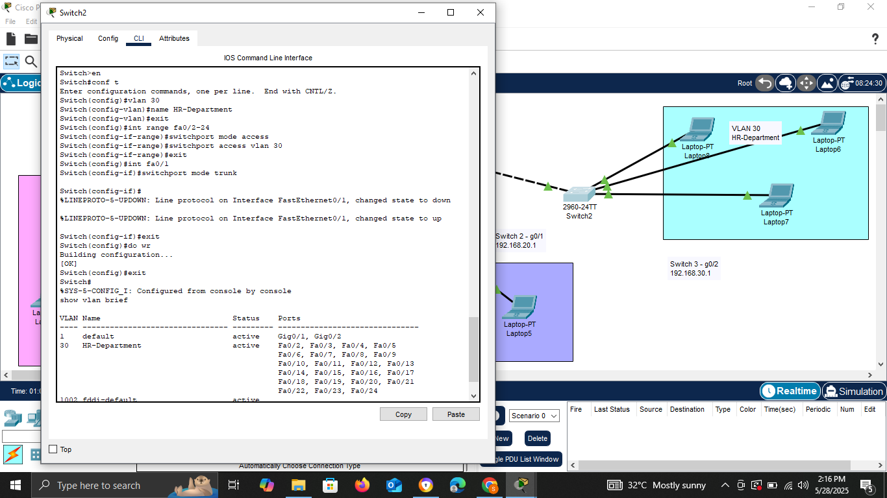
- click on the Switch 3 device
- enter into the CLI

```bash
Switch> enable
Switch# configure terminal
Switch(config)# vlan 30
Switch(config-vlan)# name HR-Department
Switch(config-vlan)# exit
Switch(config)# exit
Switch# show vlan brief !To see the created vlan
```

### Assign Ports to VLAN 30 (Fa0/2–Fa0/24)

```bash
Switch# configure terminal
Switch(config)# int range fa0/2-24
Switch(config-if-range)# switchport mode access
Switch(config-if-range)# switchport access vlan 30
Switch(config-if-range)# exit
```

### Make Fa0/1 a Trunk Port on Switch 3

```bash
Switch(config)# int fa0/1
Switch(config-if)# switchport mode trunk
Switch(config-if)# exit
Switch(config)# do wr
Switch(config)# exit
```

## STEP 5: Configure VLANs on the Multilayer Switch
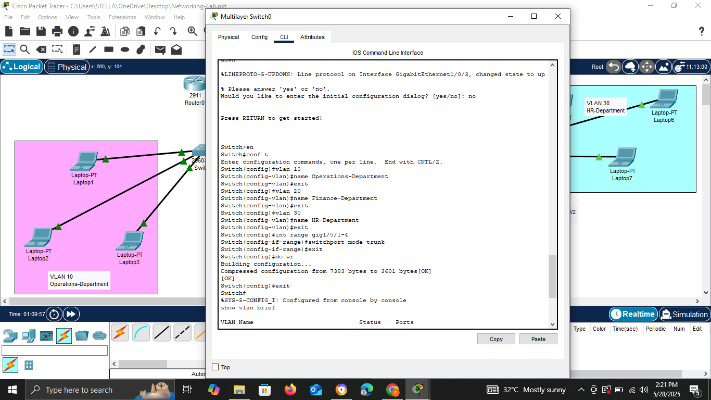
- click on the Multilayer switch device
- enter into the CLI

```bash
Switch> enable
Switch# configure terminal
Switch(config)# vlan 10
Switch(config-vlan)# name Operations-Department
Switch(config-vlan)# exit
Switch(config)# vlan 20
Switch(config-vlan)# name Finance-Department
Switch(config-vlan)# exit
Switch(config)# vlan 30
Switch(config-vlan)# name HR-Department
Switch(config-vlan)# exit
Switch(config)# exit
Switch# show vlan brief
```

### Configure Trunks on the Multilayer Switch
The port you choose on the Multilayer that connects to the Access Switches and Router

```bash
Switch(config)# int range gig1/0/1-4
Switch(config-if-range)# switchport mode trunk
Switch(config-if-range)# exit
Switch(config)# do wr
Switch(config)# exit
```

## STEP 6: Configure Router Subinterfaces for Inter-VLAN Routing
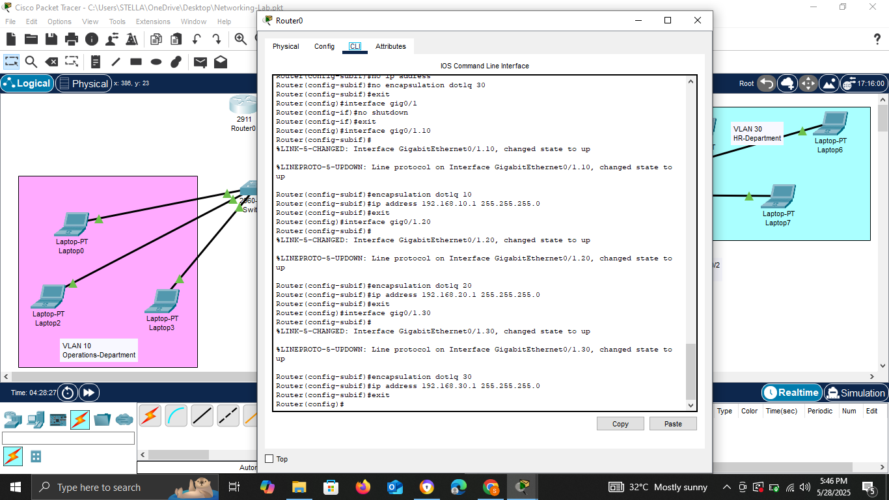
Identify the interface connected to the router (Gig0/1)

```bash
Router> enable
Router# configure terminal
Router(config)# int gig0/1
Router(config-if)# no shutdown
Router(config-if)# exit
```

### Create Subinterface according to the VLAN IDs (10, 20, 30)
- Router CLI
### VLAN 10 Subinterface

```bash
Router(config)# int gig0/1.10
Router(config-subif)# encapsulation dot1Q 10
Router(config-subif)# ip address 192.168.10.1 255.255.255.0
```

### VLAN 20 Subinterface

```bash
Router(config)# int gig0/1.20
Router(config-subif)# encapsulation dot1Q 20
Router(config-subif)# ip address 192.168.20.1 255.255.255.0
```

### VLAN 30 Subinterface

```bash
Router(config)# int gig0/1.30
Router(config-subif)# encapsulation dot1Q 30
Router(config-subif)# ip address 192.168.30.1 255.255.255.0
```

## STEP 7: Create DHCP Pools on the Router CLI
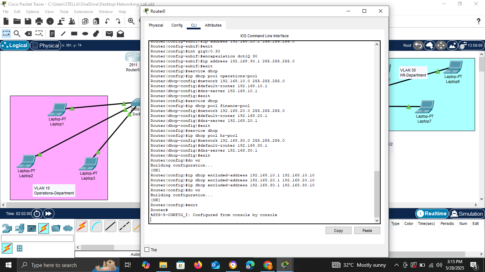
This will automatically assign ip addresses to the devices on the network
### Operations VLAN 10 Pool

```bash
Router(config)# service dhcp
Router(config)# ip dhcp pool operations-depart
Router(dhcp-config)# network 192.168.10.0 255.255.255.0
Router(dhcp-config)# default-router 192.168.10.1
Router(dhcp-config)# dns-server 192.168.10.1
Router(dhcp-config)# exit
```

### Finance VLAN 20 Pool

```bash
Router(config)# ip dhcp pool finance-depart
Router(dhcp-config)# network 192.168.20.0 255.255.255.0
Router(dhcp-config)# default-router 192.168.20.1
Router(dhcp-config)# dns-server 192.168.20.1
Router(dhcp-config)# exit
```

### HR VLAN 30 Pool

```bash
Router(config)# ip dhcp pool hr-depart
Router(dhcp-config)# network 192.168.30.0 255.255.255.0
Router(dhcp-config)# default-router 192.168.30.1
Router(dhcp-config)# dns-server 192.168.30.1
Router(dhcp-config)# exit
Router(config)# do wr
```

## STEP 9: Exclude ranges of IP addresses that should not be assigned dynamically


```bash
Router(config)# ip dhcp excluded-address 192.168.10.1 192.168.10.10
Router(config)# ip dhcp excluded-address 192.168.20.1 192.168.20.10
Router(config)# ip dhcp excluded-address 192.168.30.1 192.168.30.10
Router(config)# do wr
Router(config)# exit
```

## STEP 10: Enable DHCP on End devices (Laptops) 
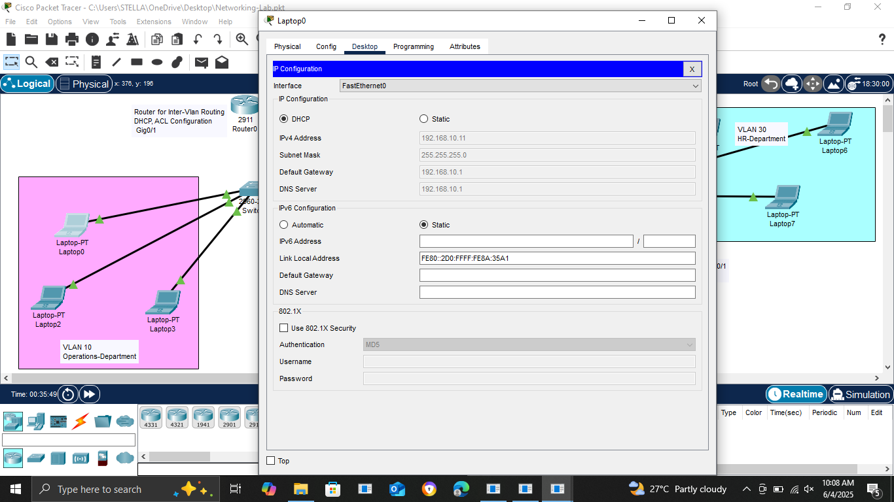
- Click Laptop > Desktop > IP Configuration
- Set to **DHCP** on all devices in the set-up

## STEP 11: Test Inter-VLAN Routing by Pinging devices across VLANs
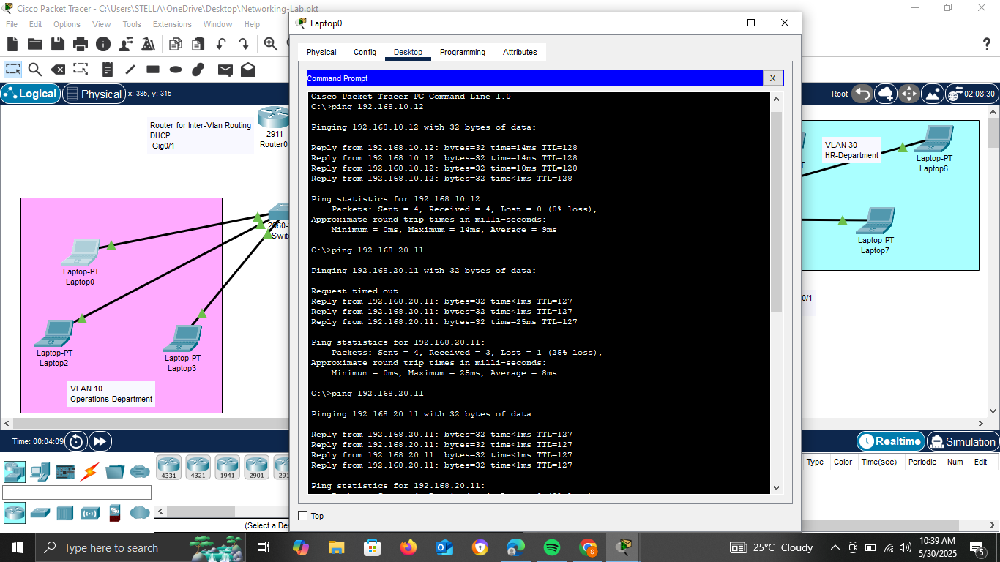
Click on the laptop device > Choose Desktop > Command Line

```bash
ping 192.168.10.12
ping 192.168.20.11
ping 192.168.30.13
```
from Laptop 1

Repeat for other laptop devices to test connectivity across the vlans.

## STEP 12: Access Control  Lists  (ACLs ) Configuration on Router
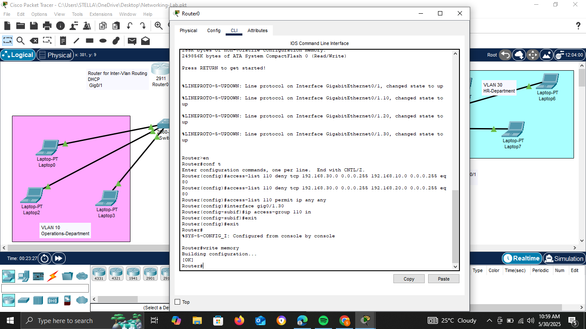
Goal: 
- Blocks HTTP traffic from HR (VLAN 30) to both Operations (VLAN 10) and Finance (VLAN 20)
-  Allows all other traffic (including pings, DNS, HTTPS, file shares, etc.) between all VLANs

We will be configuring an extended ACLs.

On Router CLI
```bash
Router> enable
Router# configure terminal
Router(config)# access-list 110 deny tcp 192.168.30.0 0.0.0.255 192.168.10.0 0.0.0.255 eq 80
Router(config)# access-list 110 deny tcp 192.168.30.0 0.0.0.255 192.168.20.0 0.0.0.255 eq 80
Router(config)# access-list 110 permit ip any any
```

### Apply ACL to the HR VLAN 30 Subinterface 
Identify subinterface on the router

```bash
Router(config)# interface gig0/1.30
Router(config-subif)# ip access-group 110 in
Router(config-subif)# exit
```

## STEP 13: Test ACL Rules
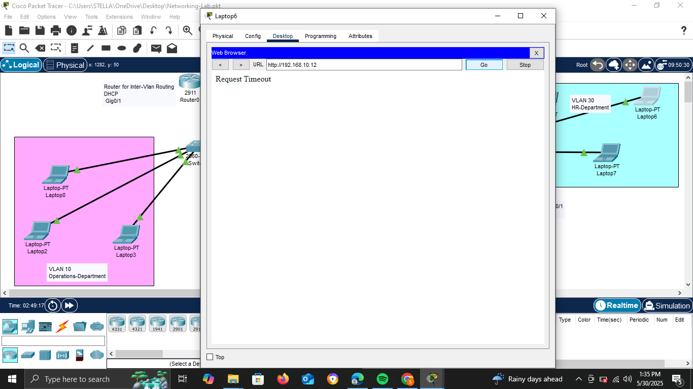
- From HR Laptop (VLAN 30) > Web Browser > Visit: `http://192.168.10.12` (web server in the operation deptment - vlan 10)

Result: Request Timeout
Interpretation: ACL rule successfully blocking http traffic to vlan 10 & 20

- Run `ping 192.168.10.12` (vlan 10 device ip) from HR (vlan 30) Laptop
should work (ICMP is allowed) from the HR laptop in the command line
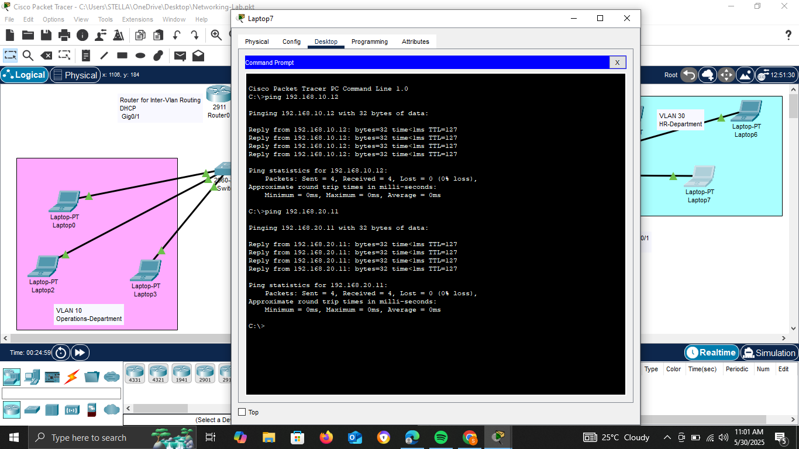
